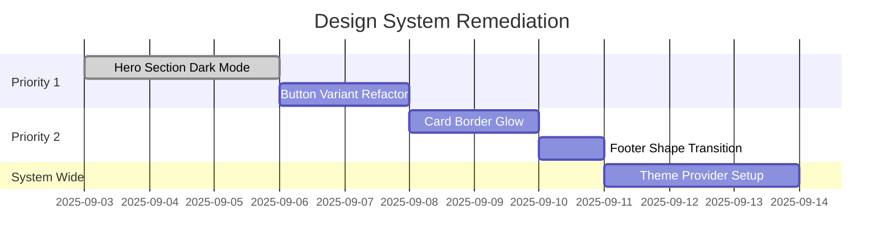

# Nexus AI Project Progress

## Design System Audit (2025-09-03)
### Key Findings
**✅ Full Alignment**  
- Color system foundation established  
- Typography implementation correct  
- Core motion infrastructure in place  

**⚠️ Critical Issues**  
- Component style deviations (cards/buttons)  
- Layout philosophy inconsistencies  
- Motion timing mismatches  
- Dark mode implementation gaps  

**🚧 Active Work**  

**✅ Completed Refinements**
- Hero Section (2025-09-03)
  - Removed animated SVG elements for cleaner visual hierarchy
  - Corrected background image implementation:
    - Removed opacity from base image for full detail
    - Implemented sophisticated gradient overlay:
      - Left side: from-gray-900/80 for text contrast
      - Right side: Transparent for image visibility
  - Implemented subtle Ken Burns effect for elegant dynamism
  - Simplified visual language aligning with "Less is More" philosophy
  - Improved dark mode contrast and readability
  - Documented pattern in designSystem.md for reuse

- Social Proof Section (2025-09-03)
  - Removed placeholder logo boxes for cleaner presentation
  - Centered single Globant logo with proper sizing
  - Enhanced logo visibility:
    - Applied direct CSS variables for background (var(--card))
    - Used brightness/invert filters for dark mode visibility
  - Implemented reliable hover interactions:
    - Converted to client component for interactivity
    - JavaScript event handlers for precise control
    - Direct style manipulation for guaranteed effects
    - Smooth transitions for background and filters
  - Added cursor feedback for better UX
  - Optimized with Next.js Image component

- Header Section (2025-09-03)
  - Enhanced scroll behavior:
    - Added scroll position tracking
    - Increased background opacity on scroll (95%)
    - Improved backdrop blur effect
  - Updated theme integration:
    - Used proper theme color variables
    - Consistent text and border colors
    - Smooth opacity transitions

- Featured Case Studies Section (2025-09-03)
  - Updated with Gemini-generated images
  - Enhanced image presentation:
    - Fixed aspect ratio container (16:9)
    - Added proper overflow handling
    - Improved hover animations
  - Optimized image loading:
    - Added responsive sizes
    - Maintained Next.js Image optimization
  - Updated color scheme to match theme system

- Technical Fixes (2025-09-03)
  - Resolved server component errors:
    - Added 'use client' directive to about page
    - Added 'use client' to featured case studies
    - Added 'use client' to services section
    - Added 'use client' to CTA section
    - Fixed framer-motion animations
    - Maintained component interactivity
  - Fixed icon rendering issues:
    - Added type safety to icon maps
    - Implemented fallback icons
    - Added runtime checks for icon existence
    - Maintained consistent icon styling

- Strategic Content Refactoring (2025-09-03)
  - Shifted core messaging focus:
    - From: Technical ML/Data focus
    - To: Business outcomes & automation
  - Streamlined content across site:
    - Updated hero with action-oriented headline
    - Refocused services on automation workflows
    - Rewrote case studies to emphasize results
    - Simplified about page content
  - Enhanced documentation:
    - Created productContext.md for new strategy
    - Updated projectbrief.md alignment
    - Maintained design system consistency

### Next Steps
1. Implement priority component fixes  
2. Establish dark mode baseline  
3. Conduct follow-up accessibility review
